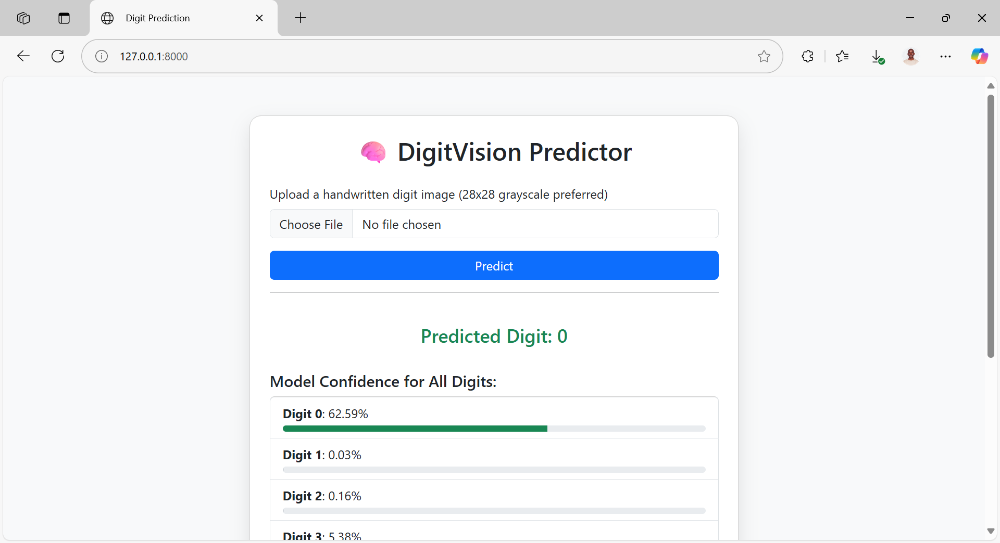

# DigitVision

DigitVision is a web-based handwritten digit recognition app built using **Django** and a pre-trained **TensorFlow** model. Users can upload images of handwritten digits (preferably 28x28 grayscale) and receive predictions with a breakdown of the model's confidence for each possible digit (0–9).

 <!-- Optional: Add a screenshot path if available -->

---

## Features

-  Upload and analyze handwritten digit images
-  Real-time prediction using a CNN model (trained on MNIST)
-  Displays confidence scores for **all 10 digits**
-  Clean, responsive UI using Bootstrap 5
-  Easy to extend with canvas drawing or model enhancements

---

## Demo

Upload a 28x28 grayscale digit image and view predictions:

- **Predicted digit** is shown prominently
- **All confidence scores** are visualized via progress bars

---

## Tech Stack

| Layer       | Technology              |
|-------------|--------------------------|
| Backend     | Django (Python 3)        |
| ML Model    | TensorFlow / Keras       |
| Frontend    | HTML + Bootstrap 5       |
| Deployment  | WSGI (run locally or via Gunicorn/Nginx) |

---

## Project Structure

```
digit-vision/
├── digitvision/             # Django project settings
├── predictor/               # App containing views and templates
│   ├── templates/predictor/index.html
│   ├── views.py
│   └── ...
├── model/
│   └── model.h5             # Trained TensorFlow model
├── media/                   # Uploaded images (temp storage)
├── staticfiles/             # Collected static files (for deployment)
├── db.sqlite3
└── README.md
```

---

## Setup Instructions

### 1. Clone the Repo

```bash
git clone https://github.com/yourusername/digit-vision.git
cd digit-vision
```

### 2. Create Virtual Environment

```bash
python3 -m venv venv
source venv/bin/activate
```

### 3. Install Requirements

```bash
pip install -r requirements.txt
```

### 4. Run the Server

```bash
python manage.py runserver
```

Visit: `http://127.0.0.1:8000/` in your browser.

---

## Model Info

- Dataset: [MNIST Handwritten Digits](https://keras.io/api/datasets/mnist/)
- Model: Simple CNN trained with Keras
- Input Shape: 28x28 grayscale images
- Output: 10-class softmax probabilities (digits 0–9)

---

## 📦 Future Improvements

- 🎨 Add drawing canvas for direct digit input
- 📱 Make UI fully mobile-optimized
- ☁️ Deploy to Vercel, Heroku, or AWS
- 🔁 Allow multiple image uploads
- 🧪 Add tests and validation pipeline

---

## 📄 License

This project is licensed under the MIT License.

---

## 🙌 Acknowledgments

- [TensorFlow](https://www.tensorflow.org/)
- [Django](https://www.djangoproject.com/)
- [Bootstrap 5](https://getbootstrap.com/)
- [MNIST Dataset](http://yann.lecun.com/exdb/mnist/)

---

> Built with ❤️ by [Justus Kimtai](https://github.com/justkimtai)
